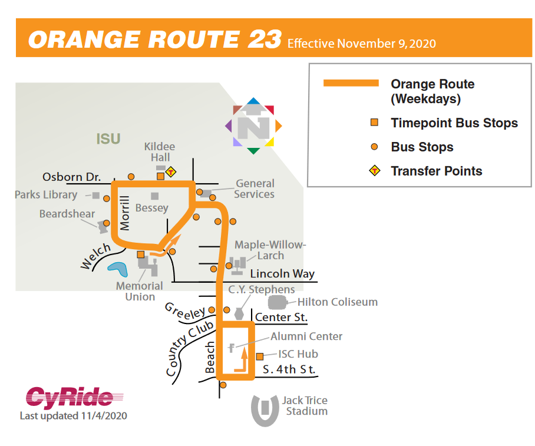

# Ohne Driver Bus System Experiment
Research project to recreate driver wheel position from bus footage.

Bus footage received from cyride for the orange route at iowa state university. 

     

This repo represents the efforts to model autonomous bus systems already in ames using advanced interpolating ai models, localization models, and more. 

## Results from Localizion Models 

live pose estimation results

TO DO LIST:
- [x] Create Repo and Read me 
- [x] Create temporary requirements.txt file
- [ ] Create Optimized requirements.txt file 
- [ ] Do live pose estimation and do documentation include gif 
- [ ] use interpolate model to create more frames
- [ ] use super res models to super resolutionize the frames
- [ ] redo and analyze efficiency before and after interpolation and super resolution on the live pose estimation 
- [ ] 
